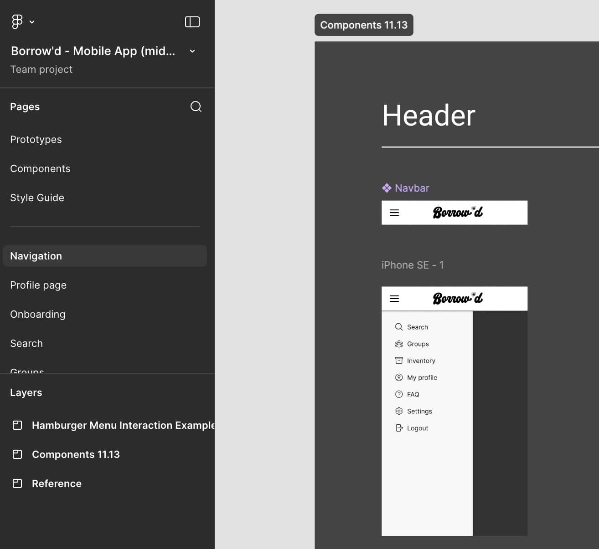
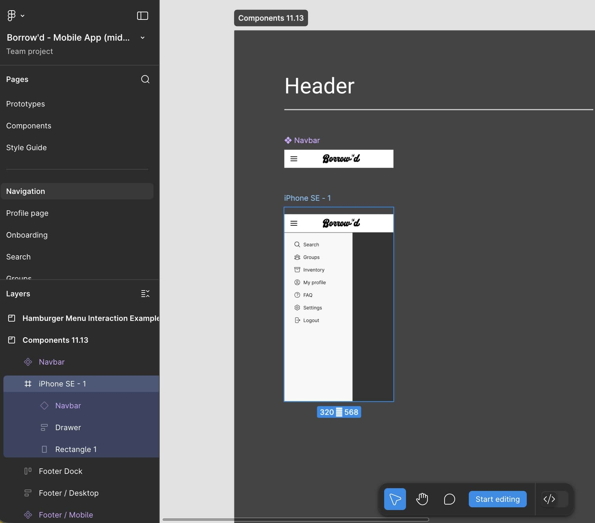
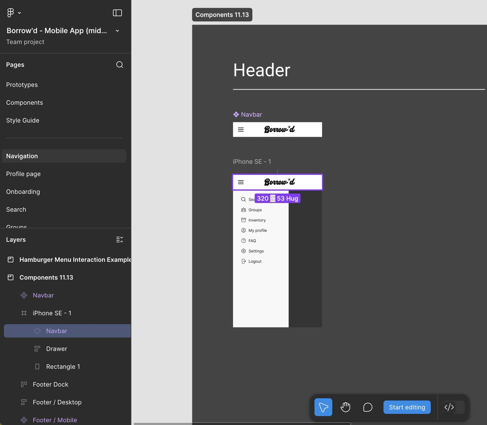
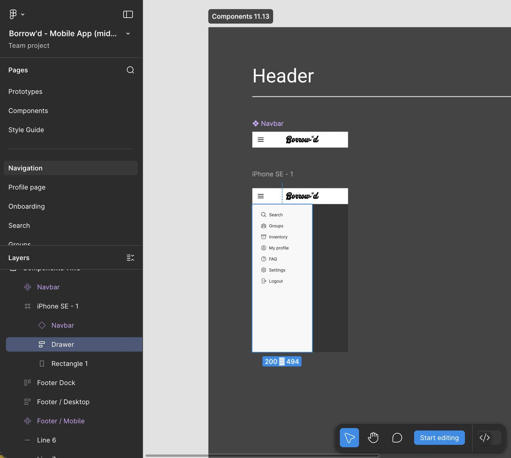
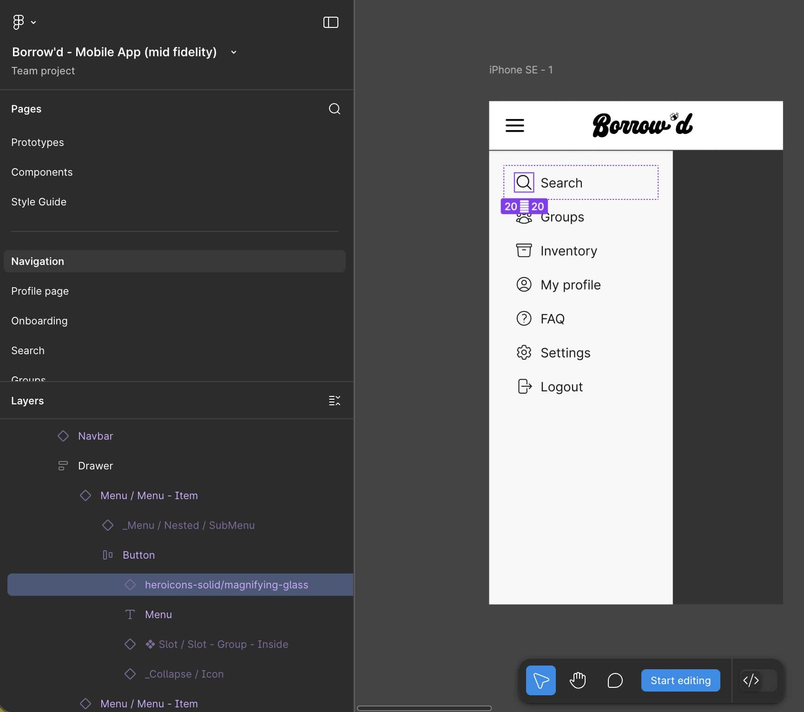
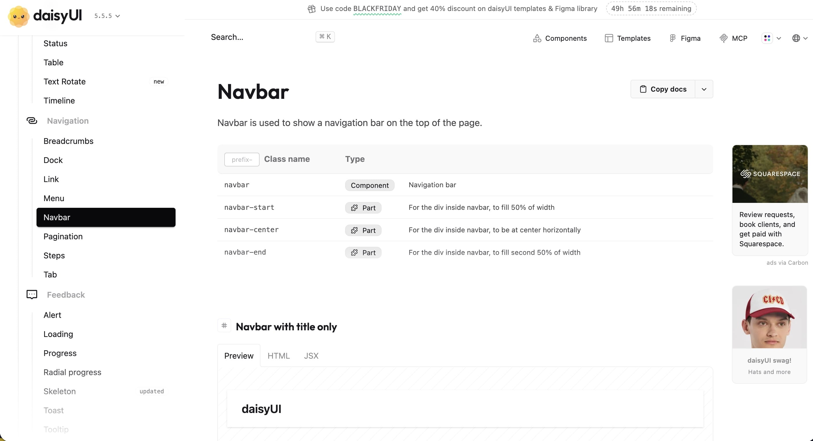
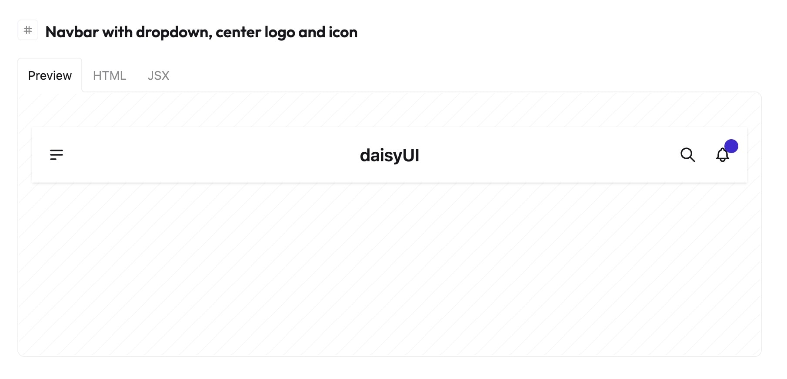
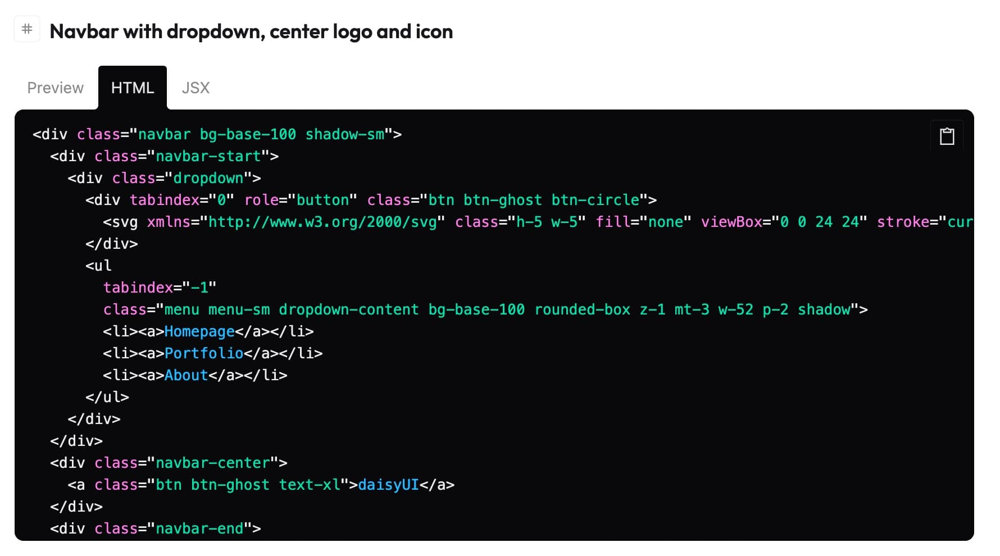

# Figma to DaisyUI Implementation Guide

This guide walks you through translating Figma designs (built with DaisyUI components) into Django templates for the Borrow'd project.

## Table of Contents
- [DaisyUI Configuration](#daisyui-configuration)
- [General Workflow](#step-by-step-workflow)
- [Additional Resources](#additional-resources)

---

## DaisyUI Configuration

Borrow'd uses a custom DaisyUI configuration with:
- **No built-in themes** (`themes: false`)
- **Class prefix** `dui-` for all DaisyUI classes

This configuration is set in `static/css/main.css`:

All DaisyUI classes must be prefixed with `dui-`. For example:
- DaisyUI docs show: `navbar` We use: `dui-navbar`
- DaisyUI docs show: `btn`, `btn-primary`. We use: `dui-btn`, `dui-btn-primary`

---

## General Workflow

The examples below will showcase a transition of a navbar from non-Daisy components to Daisy UI components.

*Sidenote:* Although Daisy UI uses the term "components", it's easier (at least it was for me at the time of writing this) to think of Daisy UI as a styles library rather than a component library. Something more akin to Tailwind rather than MUI or ShadCN.

### 1. Open the Figma design

Navigate to the specific screen or component you need to implement in Figma. In our case, the new navbar has a sidebar rather than the old dropdown.



### 2. Select the component

Click on the UI element you want to implement. This will highlight it in the design view. Clicking an entire screen will show all the elements within it.



### 3. Find the component name(s) in the 'Layers' panel

Look at the **Layers panel** on the left side of Figma. The selected component will be highlighted, showing the DaisyUI component name. In our case, we select the navbar component first.

- DaisyUI components often(not always) have a purple/violet icon in Figma
- The component name typically matches the DaisyUI component name (e.g., "Navbar", "Drawer", "Menu", etc...)



#### 3a. Nested components
Most components you'll see in Figma hold nested elements, many of which will likely be Daisy UI components. These nested elements can be found by expanding the dropdown icons for the component in question.

For instance, in our case, we can find out the specific icon used in the 'Search' link portion of the `Drawer` component by clicking the arrow icon to the left of the component name in the layers.

You can also double-click the design on the visual fields to drill down to the desired layer.




*The magnifying glass icon is shown as "heroicons-solid/magnifying-glass"*

### 4. Find component(s) in DaisyUI docs

Once you identify the component name(s), search for it(them) in the DaisyUI documentation. In our case, the main components were: [Navbar](https://daisyui.com/components/navbar/) and [Drawer](https://daisyui.com/components/drawer/).

You should see the relevant class-names for the component at the top of the Daisy UI page, as well as a few examples of how the component can be used. At this point, it would be wise to briefly map out the component.



### 5. Map out the overall component(s)
You've found the component(s) on Daisy UI! Yay! But none of the examples exactly match what you need. You'll have to do some thinking and planning. Ugh, I know. 🤢

Here's a general approach, along with specific examples of how the navbar redesign was mapped out.

  #### 5a. Identify the general structure
 Looking at the Figma design, identify the main UI elements for your specific component. For the example case, we have:
  - A **Navbar** on the top, which has a hamburger icon (left) and logo (center). I assumed there might be some auth buttons on the right if the user was not logged in, but otherwise, the right would just be blank space.
  - A **Drawer Sidebar** on the left, which has a vertical list of navigation links with icons on the left.

  #### 5b. Match elements to DaisyUI components and examples
  Start with the obvious components and examples Daisy UI provides. Use the example as a guide to see how Daisy UI approached a similar design.

  For our case, the `Navbar` component page has an example with a hamburger icon on the left, a logo in the center, and some icons on the right. This is almost exactly what we need, and can easily be adapted. We also see from this (and from the Figma design if you're observant) that a `Menu` component is used for navigation links.

  
  


  #### 5c. Link any missing pieces
 This section is for anything you notice that needs a bit of "outside-the-box" thinking.
 Maybe the design document has a complex case that isn't showcased by a single Daisy UI example. Maybe you need different `Timeline`s compared through a `Diff`. Maybe you need a wizard-sort-of-thing using  `Steps` and forms with a `Tooltip` for each step and a loading state while each step's form is being processed. Whatever it is, you'll need to figure out a way to link all the parts together.

 For our `Navbar` case, the `Navbar` examples in DaisyUI docs don't show sidebar functionality, only dropdowns. We have to figure out how to trigger the `Drawer`from the `NavBar`. Luckily, the Daisy UI docs aren't the worst thing in the world, and there is documentation to show how to trigger a `Drawer` to open. There's probably also the documentation you need for your issue.

 For your piece, you'll need to read the documentation for each component to see how they work, and then piece together the best (simplest) way to get your desired functionality.

  #### 5d. Map the final structure
 You've thought out a general structure for how you're going to get your UI to look like the Figma design. Great! Make sure you map this out with some bare-bones HTML, so you have a general idea of how it will work.

 As an example, here's what the `Navbar` + `Drawer` sketch would look like:

 ```django
<!-- Navbar -->
<div class="dui-navbar">
  <div class="dui-navbar-start">
    <!-- If authed, show 🍔  -->
    
    <!-- Hamburger button toggles drawer via label for="main-drawer" -->
    <label for="main-drawer" class="dui-btn">
      <svg>
        <!-- Hamburger -->
      </svg>
    </label>
    
  </div>
  <div class="dui-navbar-center">
    <a href="">Logo</a>
  </div>
  <div class="dui-navbar-end">
    <!-- If not authed, show sign in/up -->
    
      <!-- Auth link buttons -->
    
  </div>
</div>

<!-- Drawer -->
<!-- Show only if authed -->

<div class="dui-drawer">
  <!-- Hidden checkbox controls drawer open/close state -->
  <input id="main-drawer" type="checkbox" class="dui-drawer-toggle" />
  <!-- Main content empty, as drawer is just for sidebar -->
  <div class="dui-drawer-content"></div>
  <!-- Sidebar -->
  <div class="dui-drawer-side">
    <!-- Clicking overlay closes drawer -->
    <label for="main-drawer" class="dui-drawer-overlay"></label>
    <!-- Menu -->
    <ul class="dui-menu">
      <li><a href="">Search</a></li>
      <!-- Others... -->
    </ul>
  </div>
</div>

```

### 6. Find the relevant HTML template files
Find or create the relevant files to implement the UI. In our case, the relevant files were `templates/include/header.html` and `templates/base.html`. The `header.html` file included the previous navbar. The `base.html` included the functionality for the dropdown menu of the old navbar, which needed to be deleted as it would all be handled by Daisy UI.

### 7. Adapt your mapped out component to the Django template
Using the basic HTML structure you developed in part 5, implement the changes needed to the files you identified in part 6. This will be the step where any final styling will happen as well. Remember to add the `dui-` prefix to all DaisyUI classes and finish by comparing your final result with the Figma document.

___

## Additional Resources

- [DaisyUI Documentation](https://daisyui.com/)
- [DaisyUI Components Gallery](https://daisyui.com/components/)
- [TailwindCSS Documentation](https://tailwindcss.com/docs)
- [Font Awesome Icons](https://fontawesome.com/icons)
- [Django Template Language](https://docs.djangoproject.com/en/stable/ref/templates/language/)
