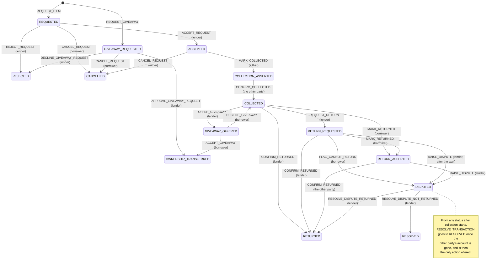

# Item lifecycle

How an item moves through a loan or a giveaway, and where that lives in the code.

| File | What's there |
| --- | --- |
| `borrowd_items/statuses.py` | `TransactionStatus`, `ItemStatus`, `ItemAction`, the status sets, and `sync_item_status`. Imports no models, so anything can use it. |
| `borrowd_items/flow.py` | The transition table (`TRANSITIONS`) and the executor. |
| `borrowd_items/models.py` | `Item.get_actions_for` / `get_action_context_for` (what can this user do) and `Item.process_action` (do it). Both read the table. |

## The flow

`REJECTED`, `CANCELLED`, `RETURNED`, `RESOLVED` and `OWNERSHIP_TRANSFERRED` are terminal. "The other party" means whoever didn't make the last change, so nobody confirms their own step.

## The table

Each `Transition` is one row: `source`, `action`, `target`, `actor` (lender, borrower or either, from the transaction's parties), an optional `guard`, and two optional effects: `prepare` (edits the transaction before it's saved) and `after_save` (everything that needs the saved row, like handing over ownership).

- `eligible_transitions(tx, user, now=...)` is what this user can do right now. If a row marked `preempts` is eligible (resolving around a departed account), it's the only one returned.
- `execute_transition(item, tx, user, action, now=...)` picks the action from that same list or refuses, then: sets the target and `updated_by`, runs `prepare`, saves the transaction, runs `after_save`, and sets `Item.status` from the transaction. It returns the row it applied.
- The table never reads the clock. Callers pass `now`.

Requesting an item and subscribing to availability aren't rows: there's no transaction yet to move. `process_action` handles those itself.

## Commands from clients

`Item.revision` goes up on every change to the item or any of its transactions, including a status that leaves and comes back. A client sends what it was showing, and `run_item_command` checks it under the locks:

- **Stale revision or transaction:** refused with `StaleItemCommand` (`code = "stale"`), and nothing happens.
- **Key and revision:** a key requires a revision, including for non-web callers. Legacy forms with neither remain supported.
- **Retried key:** the command's recorded result is returned, even if the item has moved on, was deleted, or is no longer visible to the actor. New actions still require access. The same key with a different command is refused (`key_reused`).
- **Records:** only successes are kept, for 30 days (`prune_item_command_records`, daily cron). A retry older than that fails the revision check, so nothing can run twice.

`Item.process_action` is the same action without those checks, for code that isn't answering a client.

## Status sets

`TERMINAL` and `REQUEST` are the only hand-written sets. The rest are derived:

- `OPEN` = everything not terminal
- `BORROWER` = open, past the request
- `DUAL_CONFIRMATION` = borrower, minus `ACCEPTED` (collection has started)
- `PRE_COLLECTION` = open, before collection

A new status counts as open unless you add it to `TERMINAL`, so forgetting to classify one blocks an item instead of quietly freeing it.

## Rules that always hold

- An item has at most one open transaction. The database enforces it (`unique_open_transaction_per_item`).
- `party1` is the lender and is the item's owner while the transaction is open. `process_action` refuses to act if they disagree.
- `Item.status` is a copy of the open transaction's status, written only by `sync_item_status`. `manage.py repair_item_statuses` re-derives it if it ever drifts.
- Anything that writes lifecycle state locks the account, then the item, in that order. See "Lifecycle locking" in `AGENTS.md`.

## Adding a step

1. Add the status to `TransactionStatus` (and to `TERMINAL` if it ends things), and map it in `ITEM_STATUS_FOR_TRANSACTION`.
2. Add its rows to `TRANSITIONS`, with any guard and effects.
3. Add what it writes to `EXPECTED_WRITES` in `borrowd_items/tests/test_item_lifecycle_writes.py`.

The table tests in `test_flow.py` fail until every open status has a way out, no action appears twice from one status, and every row (other than the resolution ones) has a matching entry in `EXPECTED_WRITES`.
