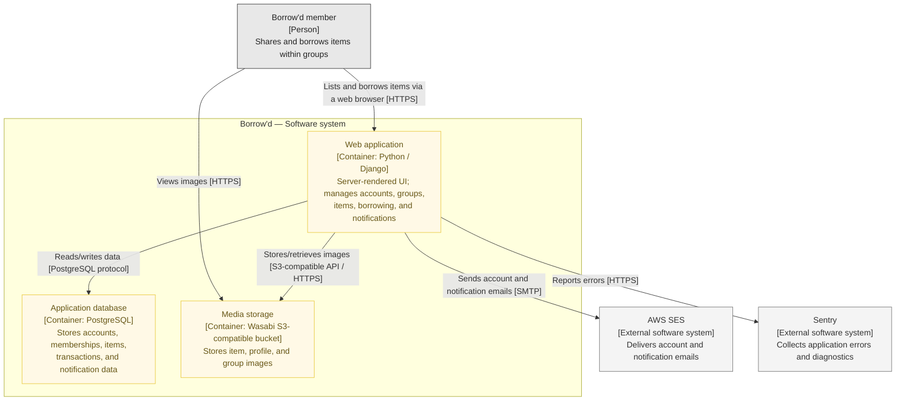

```mermaid
flowchart TD
    user["Borrow'd member<br/>[Person]<br/>Shares and borrows items within groups"]

    subgraph borrowd["Borrow'd — Software system"]
        app["Web application<br/>[Container: Python / Django]<br/>Server-rendered UI; manages accounts, groups,<br/>items, borrowing, and notifications"]
        db["Application database<br/>[Container: PostgreSQL]<br/>Stores accounts, memberships, items,<br/>transactions, and notification data"]
        media["Media storage<br/>[Container: Wasabi S3-compatible bucket]<br/>Stores item, profile, and group images"]
    end

    email["AWS SES<br/>[External software system]<br/>Delivers account and notification emails"]
    sentry["Sentry<br/>[External software system]<br/>Collects application errors and diagnostics"]

    user -->|"Lists and borrows items via a web browser [HTTPS]"| app
    user -->|"Views images [HTTPS]"| media
    app -->|"Reads/writes data [PostgreSQL protocol]"| db
    app -->|"Stores/retrieves images [S3-compatible API / HTTPS]"| media
    app -->|"Sends account and notification emails [SMTP]"| email
    app -->|"Reports errors [HTTPS]"| sentry

    classDef personStyle fill:#e8e8e8,stroke:#333,color:#222
    classDef containerStyle fill:#fff9e6,stroke:#e8c83d,color:#685818
    classDef externalSystemStyle fill:#f4f4f4,stroke:#777,color:#333

    class user personStyle
    class app,db,media containerStyle
    class email,sentry externalSystemStyle
```
