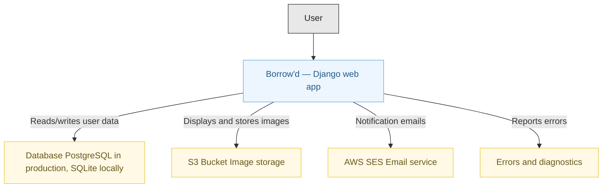

```mermaid
flowchart TD
    user["User"]
    app["Borrow'd — Django web app"]
    db["Database PostgreSQL in production, SQLite locally"]
    s3["S3 Bucket Image storage"]
    ses["AWS SES Email service"]
    sentry["Errors and diagnostics"]

    user --> app
    app -->|"Reads/writes user data"| db
    app -->|"Displays and stores images"| s3
    app -->|"Notification emails"| ses
    app -->|"Reports errors"| sentry

    classDef userStyle fill:#e8e8e8,stroke:#333,color:#222
    classDef appStyle fill:#edf6ff,stroke:#63ace5,color:#245a87
    classDef serviceStyle fill:#fff9e6,stroke:#e8c83d,color:#685818

    class user userStyle
    class app appStyle
    class db,s3,ses,sentry serviceStyle
```